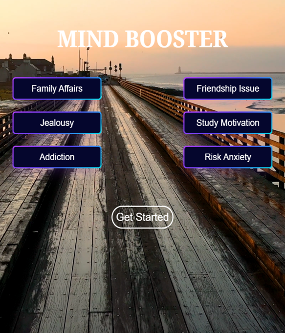
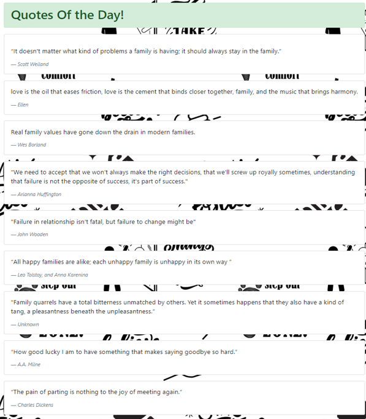
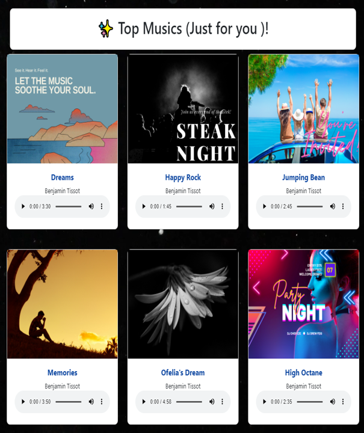
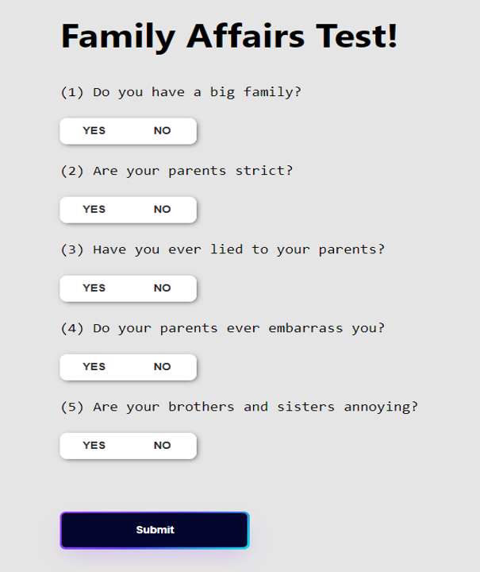

# Mind Booster Website

A responsive web platform designed to boost mental wellness through motivational content, therapeutic resources, and interactive tools.

## Key Features
- **Inspirational Quotes Library** - Curated collection of motivational quotes
- **Therapeutic Music Player** - Mood-enhancing audio content
- **Interactive Assessments** - Psychological questionnaires for self-reflection
- **Stress Management Guides** - Resources for common student challenges
- **Responsive Design** - Accessible on all devices

## Target Audience
- University students facing academic stress
- Young professionals managing work-life balance
- Individuals seeking mental wellness resources

## Technology Stack
- **Frontend**: HTML5, CSS3, JavaScript
- **Design**: Responsive layout with mobile-first approach
- **Tools**: Visual Studio Code, Git version control

## Website Preview

| Homepage | Quotes Page |
|----------|-------------|
|  |  |

| Music Player | Questionnaire |
|--------------|--------------|
|  |  |

## Development Process
1. **Research Phase**: Analyzed mental health challenges among students
2. **Design Phase**: Created wireframes and UI/UX mockups
3. **Content Curation**: Collected therapeutic resources and verified content
4. **Implementation**: Developed responsive frontend components
5. **Testing**: Conducted usability testing with target users

## Key Benefits
- Provides immediate access to mental wellness tools
- Helps users channel stress into positive energy
- Offers evidence-based psychological resources
- Completely free and accessible platform

## How to Use
1. Clone the repository
2. Open `index.html` in any modern browser
3. Explore different sections using the navigation menu

## Future Enhancements
- User accounts for personalized experiences
- Community support forum
- Mood tracking functionality
- Mobile application version
